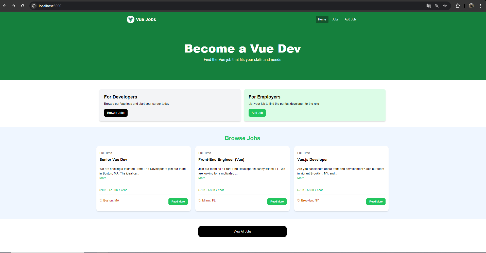
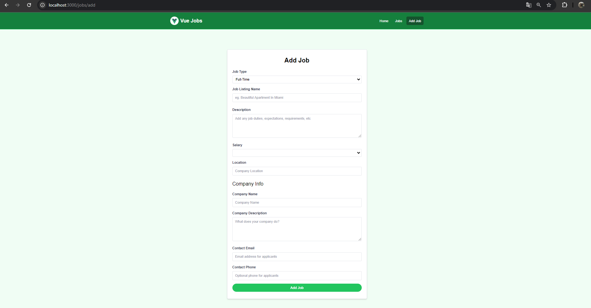
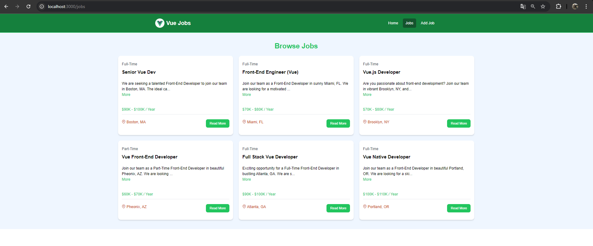

# Vue Jobs

Vue Jobs é um projeto de aplicação web para gerenciar listagens de trabalhos. Com esta aplicação, você pode adicionar, editar, remover e visualizar trabalhos disponíveis. O projeto é desenvolvido com Vue.js e oferece suporte para dados provenientes de uma API ou de um arquivo JSON local.

## Funcionalidades

- **Adicionar Trabalhos:** Permite criar novas listagens de trabalho com informações detalhadas.
- **Editar Trabalhos:** Atualize informações de trabalhos existentes.
- **Remover Trabalhos:** Exclua listagens de trabalho.
- **Visualizar Trabalhos:** Mostre a listagem de todos os trabalhos disponíveis.
- **Dados de API e JSON:** Suporte para recebimento de dados de uma API ou diretamente de um arquivo JSON.

## Imagens

### Página Inicial

### Adicionar Trabalho

### Visualizar Trabalho

